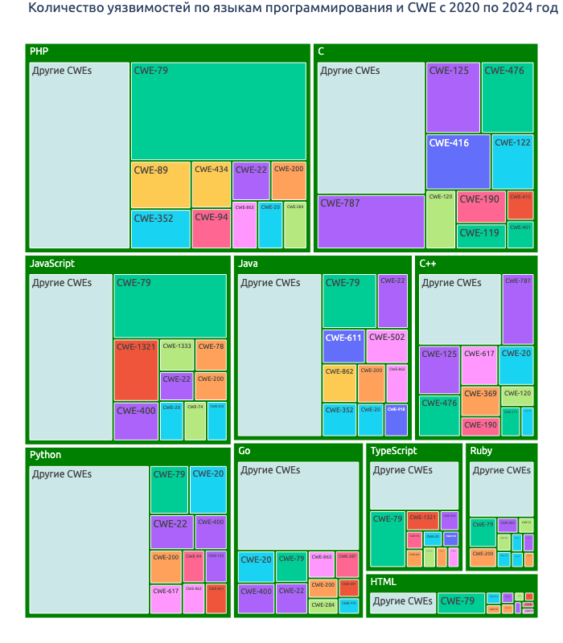
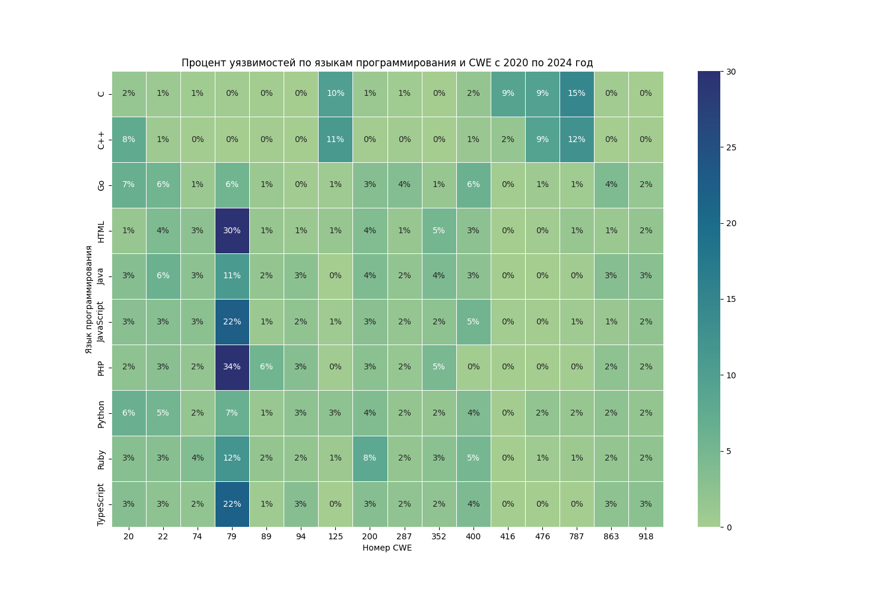

# Исследование уязвимостей в открытом исходном коде

Данный репозиторий содержит исследование, в котором изучается, какие угрозы и в каких языках программирования сейчас наиболее актуальный

## План работы

- [x] Собрать данные об уязвимостях из базы CVE Project ([процесс и результат](sv_investigation/cve_project_process.ipynb))
- [x] Собрать данные из Github Advisory ([процесс и результат](sv_investigation/github_advisory_process.ipynb))
- [x] Произвести обработку данных и сформировать информативные графики
- [] (Дополнительно) Оформить результаты в виде jupyter book

## Полученные результаты (с 2020 года)

### Обзор типов уязвимостей в разрезе ЯП

- Языки программирования лидеры по количеству уязвимостей в открытом исходном коде (по убыванию количества уязвимостей):
    1. PHP
    2. C
    3. JavaScript
    4. Python
    5. Java
- Если посмотреть результаты с 2022 года, то Python занимает уже второе место по количеству обнаруженных уязвимостей

### Процент по количеству уязвимостей в разрезе 16 наиболее популярных типов уязвимостей и 10 популярных языков программирования

- Наиболее популярный тип уязвимостей с идентификатором CWE-79: XSS (межсайтовый скриптинг)
- Для языка Python, на втором месте по популярности уязвимость неправильной валидации входных данных - CWE-20

## Usage

### Building the book

If you'd like to develop and/or build the Software Vulnerabilities Investigation book, you should:

1. Clone this repository
2. Run `poetry install && poetry shell`
3. (Optional) Edit the books source files located in the `sv_investigation/` directory
4. Run `jupyter-book clean sv_investigation/` to remove any existing builds
5. Run `jupyter-book build sv_investigation/`

A fully-rendered HTML version of the book will be built in `sv_investigation/_build/html/`.
